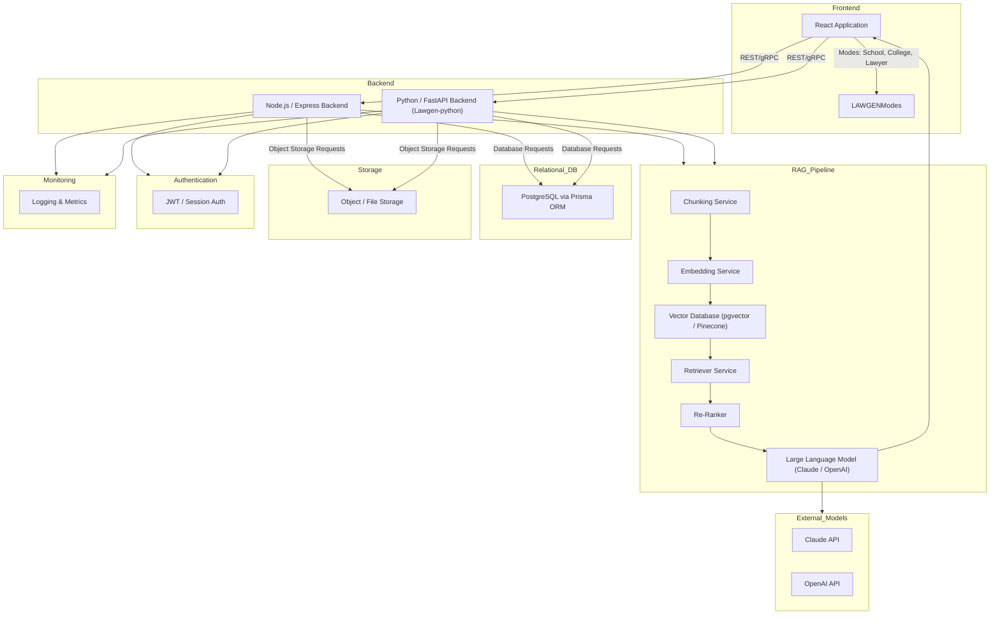
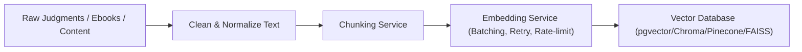
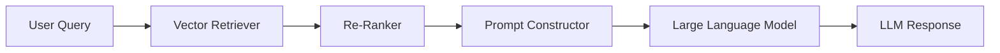
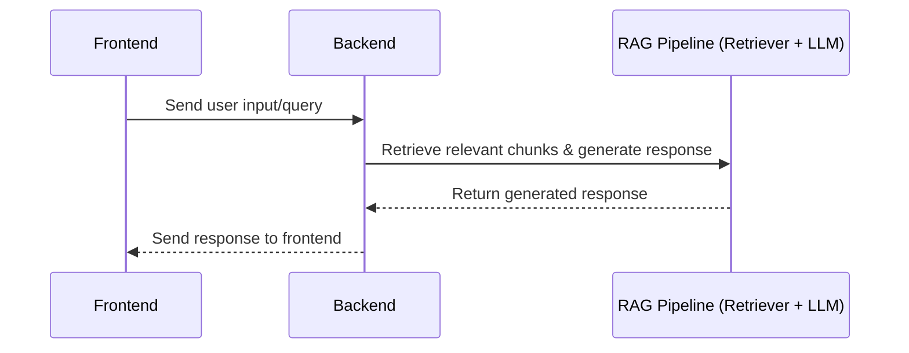
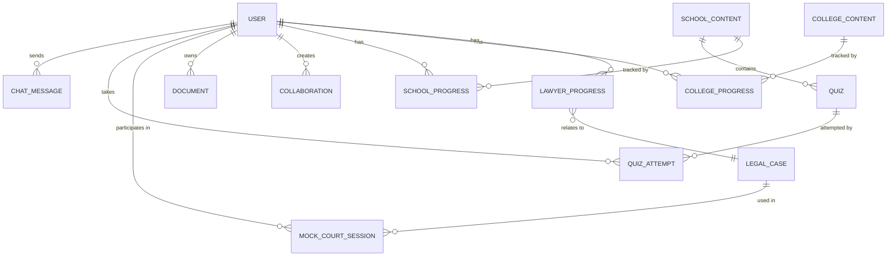

# Deliverable #1: System Architecture & Design Overview

---

## 1. High-Level System Architecture

---

## 2. Data Flow Diagrams

### 2.1 Ingestion Pipeline

### 2.2 Retrieval Pipeline

### 2.3 Frontend-Backend-RAG Message Flow

---

## 3. Entity Relationship Diagram (ERD)

### Key Models

- User (id, email, role, profile info, progress, chatMessages, etc.)
- LegalCase (caseNumber, court, parties, facts, decision, embeddings)
- SchoolContent (ebooks, quizzes, content metadata)
- CollegeContent (3D models, subject content)
- Quiz, QuizAttempt
- ChatMessage
- Collaboration
- MockCourtSession
- LawyerProgress

---

## 4. API Surface Overview

| Endpoint                  | Method | Description                              | Input Example                   | Output Example                  |
|---------------------------|--------|--------------------------------------|--------------------------------|--------------------------------|
| /api/chat/send            | POST   | Send message to chat AI                | { userId, message, mode }       | { reply, messageId, timestamp }|
| /api/chat/history         | GET    | Get last 50 messages for user          | ?userId=123                    | { messages: [ ... ] }           |
| /api/rag/query            | POST   | Retrieve RAG responses (planned)       | { query, mode }                | { results, sourceDocs }         |
| /api/video/progress       | POST   | Track user's video progress             | { userId, videoId, progress } | { success: true }               |
| /api/quiz/*               | Various | Quiz related endpoints (create, submit)| ...                          | ...                            |
| /api/cases/search         | GET    | Search legal cases (planned)            | ?query=xyz                     | { cases: [...]}                 |
| /api/cases/:id            | GET    | Fetch case details by ID (planned)      |                                | { caseDetails }                 |
| /api/cases/compare        | POST   | Compare two or more cases (planned)     | { caseIds: [...] }             | { comparisonResults }           |

- Error states: 400 for bad requests, 404 for not found, 500 for internal errors, with JSON error messages.

---

## 5. Scaling & Availability Notes

- **Horizontal scaling:** Backend and RAG pipeline components deployed in Docker containers or managed services with autoscaling.
- **Embedding batching:** Embedding requests batched for efficiency with retry and rate-limit handling.
- **Ingestion parallelism:** Multiple workers chunk and embed documents asynchronously.
- **Caching strategy:** Vector DB and query caches to reduce latency, CDN for frontend assets.
- **Rate limits:** API gateways throttle requests per user/session.
- **Object storage:** S3 or compatible storage for raw documents, media, and backups.
- **Connection pooling:** Database and vector DB connection pools managed for concurrency.
- **Index optimization:** Vector DB indexes fine-tuned for fast retrieval.
- **Cost management:** Monitor embedding API token usage and cloud resource consumption.
- **Monitoring & logging:** Centralized logging (e.g., ELK stack) and metrics dashboards (e.g., Prometheus/Grafana).

---

Deliverable #1 document complete with architecture, data flow, ERD, API surface, and scaling notes.
