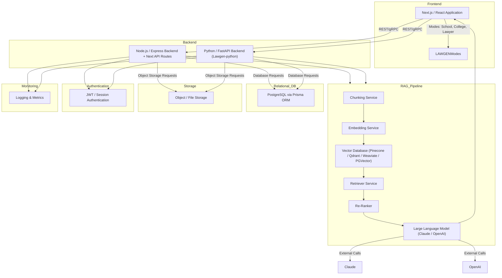
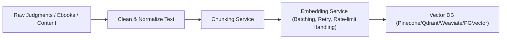
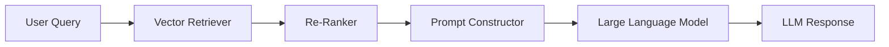
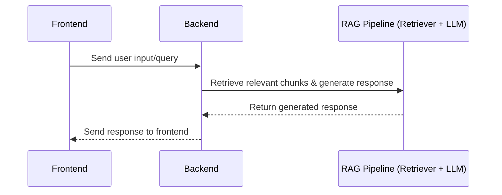
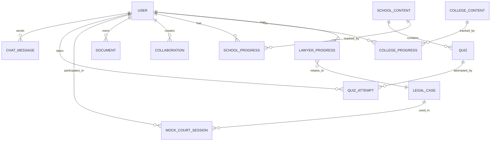

# Deliverable #1: System Architecture & Design Overview

---

## 1. High-Level System Architecture

---

## 2. Data Flow Diagrams

### 2.1 Case Ingestion Pipeline

### 2.2 Query Retrieval Pipeline

### 2.3 Frontend → Backend → RAG → Backend → Frontend Message Flow

### 2.4 Multimedia Mapping (MBBS Mode)

- Video, 3D model, and interactive content are mapped and tracked alongside textual content ingestion for a complete educational experience.

---

## 3. Entity Relationship Diagram (ERD)

Based on the Prisma schema, key models and relationships include:

### Additional Entities

- Profile (within User context)  
- VideoProgress (SchoolProgress, CollegeProgress tables)  
- Bookmarks and CaseChunks are planned extensions based on schema references.

---

## 4. Backend API Surface Overview

| Endpoint               | Method | Description                              | Input Example                           | Output Example                   |
|------------------------|--------|----------------------------------------|----------------------------------------|---------------------------------|
| /api/chat/send         | POST   | Send user message to AI chat            | { userId, message, mode }               | { reply, messageId, timestamp } |
| /api/chat/history      | GET    | Retrieve last 50 messages for user      | ?userId=123                            | { messages: [ ... ] }            |
| /api/rag/query         | POST   | Retrieve RAG query responses (planned)  | { query, mode }                        | { results, sourceDocs }          |
| /api/video/progress    | POST   | Save/update user's video progress        | { userId, videoId, progress, duration, completed } | { success: true }        |
| /api/video/progress    | GET    | Get user video progress                  | ?userId=...&videoId=...                | { userId, videoId, progress,...} |
| /api/quiz/*            | Various| Quiz management endpoints (create, submit, etc.) | Various                         | Various                         |
| /api/cases/search      | GET    | Search legal cases (planned)             | ?query=xyz                            | { cases: [...]}                 |
| /api/cases/:id         | GET    | Get detailed info for case by ID (planned) |                                    | { caseDetails }                 |
| /api/cases/compare     | POST   | Compare cases (planned)                   | { caseIds: [...] }                    | { comparisonResults }           |

### Error Handling

- 400: Bad request (missing or invalid params)  
- 404: Not found (e.g., video progress not found)  
- 500: Internal server errors  

Errors return JSON with an error message field.

---

## 5. Scaling & Availability Notes

- **Horizontal Scaling:** Backends and pipeline services run in scalable Docker containers or managed cloud services with auto-scaling.  
- **Embedding Batching:** Embedding requests are batched to optimize throughput and handle rate limits with retries.  
- **Ingestion Parallelism:** Document chunking and embedding run in parallel/asynchronously to speed processing.  
- **Caching Strategy:** Caches at vector DB and API layers reduce query latency; CDN serves frontend assets.  
- **Rate Limits:** API gateway and auth layers enforce per-user rate limits.  
- **Storage:** S3 or compatible object store holds raw documents, media, and backups.  
- **Connection Pooling:** Managed for Postgres and vector DB to maintain performance under load.  
- **Index Optimization:** Vector search indexes tuned for fast similarity queries.  
- **Cost Management:** Monitored embedding API token usage and cloud deploy resource consumption.  
- **Monitoring & Logging:** Centralized logging (e.g., ELK) and metrics dashboards (e.g., Prometheus/Grafana) track system health and usage.

---

## 6. Vector Database Optimization

Vector database optimization focuses on maximizing efficiency and speed of similarity queries and retrieval from high-dimensional vector embeddings generated from documents or queries.

Key techniques include:

- **Indexing Strategy:** Use of specialized indexes like HNSW (Hierarchical Navigable Small World) graph indexes or IVF (Inverted File) for approximate nearest neighbor (ANN) search, which significantly reduce search time for large vector collections.

- **Similarity Search Optimization:** Optimizing distance calculation algorithms (cosine similarity, Euclidean distance) and leveraging hardware acceleration (e.g., GPUs) for faster query processing.

- **Caching:** Caching frequent query embeddings and results both at application layer and within vector DB to avoid repeated computation and network calls.

- **Batching:** Grouping embedding generation and vector DB queries into batches to reduce overhead, improve throughput, and handle API rate limits gracefully.

- **Embedding Chunking:** Splitting large documents into smaller chunks to create more granular embeddings, improving recall and precision in retrieval.

These optimizations together enable scalable, low-latency semantic search capabilities crucial for delivering real-time responses in RAG pipelines.

---

This completes Deliverable #1 - System Architecture and Design Overview document.
